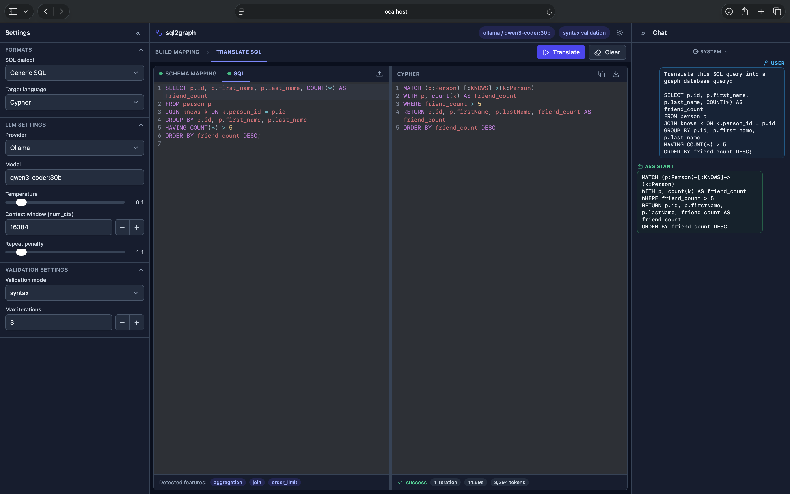

# sql2graph-web

**Browser UI over the [`sql2graph`](https://github.com/obonovai/sql2graph) library: translate SQL into Cypher / AQL / Gremlin, no Python required.**

A simple, hand-owned web front end for the `sql2graph` translator. It is a thin
wrapper: the backend calls the public `sql2graph` library API and adds no
translation logic of its own. In production the backend also serves the built
single-page app, so the whole thing runs on one origin.



## Architecture

The backend (`backend/`, FastAPI) is a thin bridge: it builds the library's own
config objects from the request, runs `AsyncSQLTranslator.translate(...)`, and
forwards the library's callbacks to the browser as Server-Sent Events. The
frontend (`frontend/`, Vite + React + TypeScript) is a three-column SPA: a
collapsible Settings sidebar, a center workbench with the mapping / SQL inputs
and the result, and a collapsible live Chat sidebar. Its API base is a hardcoded
relative `/api`, so production must be same-origin (Vite proxies it in
development). The full mental model lives in
[`docs/architecture.md`](docs/architecture.md), and the SSE pipeline is covered
in [`docs/streaming.md`](docs/streaming.md).

## Prerequisites

- The `sql2graph` library, cloned as a **sibling directory** named `sql2graph` (the
  backend installs it editable from `../../sql2graph`). See [`docs/install.md`](docs/install.md).
- Python `>=3.12` and [`uv`](https://docs.astral.sh/uv/) for the backend.
- Node.js 22 (Vite 8 requires 20.19+/22.12+) for the frontend.
- An LLM backend:
  - **Anthropic**: export `ANTHROPIC_API_KEY` for the backend (never entered in the
    browser).
  - **Ollama**: running locally or via `OLLAMA_HOST`; pull the model you select.
- **Docker** (optional): for the containerized run, or for `server` validation with an
  empty connection (auto-provisions a throwaway Neo4j / ArangoDB / Gremlin via
  testcontainers).

## Quick start (development)

Two terminals; full detail in [`docs/install.md`](docs/install.md) (Path A).

```bash
# 1) backend on :8000  (export ANTHROPIC_API_KEY and/or OLLAMA_HOST first)
cd backend && uv sync && uv run uvicorn app.main:app --reload --port 8000

# 2) frontend on :5173 (proxies /api -> :8000)
cd frontend && npm install && npm run dev
```

Open http://localhost:5173. Paste or upload a schema mapping (YAML) and a SQL query,
pick a target, and click **Translate**. Sample mappings live in
`sql2graph/examples/mappings/`.

## Build (production)

```bash
cd frontend && npm run build      # emits frontend/dist/
cd ../backend && uv run uvicorn app.main:app --port 8000
```

When `frontend/dist/` exists the backend serves the SPA from `/` (same origin, no
CORS). Open http://localhost:8000. See [`docs/install.md`](docs/install.md) (Path B).

## Docker

A single-container build serves the SPA and the API on one origin. The sibling
`sql2graph` repo is pulled in as a named build context, so both repos must be cloned
side by side (see [`docs/install.md`](docs/install.md), Path C).

```bash
cp .env.example .env              # then fill in ANTHROPIC_API_KEY and/or OLLAMA_HOST
docker compose up --build
```

Open http://localhost:8000. Secrets are injected at runtime from `.env` (never baked
into the image), and the container reports health via `GET /api/health`. The full set
of backend environment variables is documented in the
[environment variables section](docs/install.md#environment-variables-and-secrets) of
`docs/install.md`.

## Validation modes

- `none`: single shot, no checks.
- `syntax`: fast offline grammar checks, no database.
- `server`: validate each candidate against a graph DB. Fill in the connection to use
  **your** database, or leave it empty to auto-provision a **throwaway** one via
  Docker (`managed`). The DB is reached from the **backend** host, so "localhost"
  means the server's localhost. The throwaway path needs a Docker daemon reachable
  from the backend; in the single-container Docker deployment, enable it with the
  `docker-compose.docker-socket.yml` overlay (see [`docs/install.md`](docs/install.md)), or
  enter an explicit connection instead.

## API

All routes are served under the `/api` prefix. The two SSE endpoints surface invalid
config as HTTP 400 before the stream opens. The full REST reference lives in
[`docs/api.md`](docs/api.md).

## Documentation

Deep documentation lives under `docs/`, start with the
[documentation index](docs/README.md).

| Document | Contents |
|---|---|
| [`docs/architecture.md`](docs/architecture.md) | The mental model: the one-origin topology, sibling-repo coupling, both module maps, and the anatomy of a translate run. |
| [`docs/install.md`](docs/install.md) | Prerequisites, the sibling-clone layout, the three run paths (manual, production, Docker), the env table, checks, troubleshooting. |
| [`docs/api.md`](docs/api.md) | The REST reference: all eight routes, request models, response payloads, fail-soft semantics, and pre-stream HTTP 400 preconditions. |
| [`docs/streaming.md`](docs/streaming.md) | The two SSE streams end to end: bridge queue and coalescing, event vocabulary, run lifecycles, teardown, client transport. |
| [`docs/errors.md`](docs/errors.md) | Every way a run fails: pre-stream 400s, the synthetic error event, transport failures, fail-soft endpoints, warn vs reject pre-flight. |
| [`docs/state.md`](docs/state.md) | The Zustand store: slices, active vs draft mapping, request building, debounced hooks, persistence and migration. |
| [`docs/frontend.md`](docs/frontend.md) | SPA structure and conventions: the tech stack, per-file source tree, the two-workspace model, and UI conventions. |
| [`docs/types.md`](docs/types.md) | The backend/frontend type mirror: every mirror point, why no codegen, degradation conventions, and the change checklists. |
| [`obonovai/sql2graph`](https://github.com/obonovai/sql2graph) | The underlying library (cloned as the sibling `../sql2graph` on disk). |

## License

Released under the MIT License. See [`LICENSE`](LICENSE).
